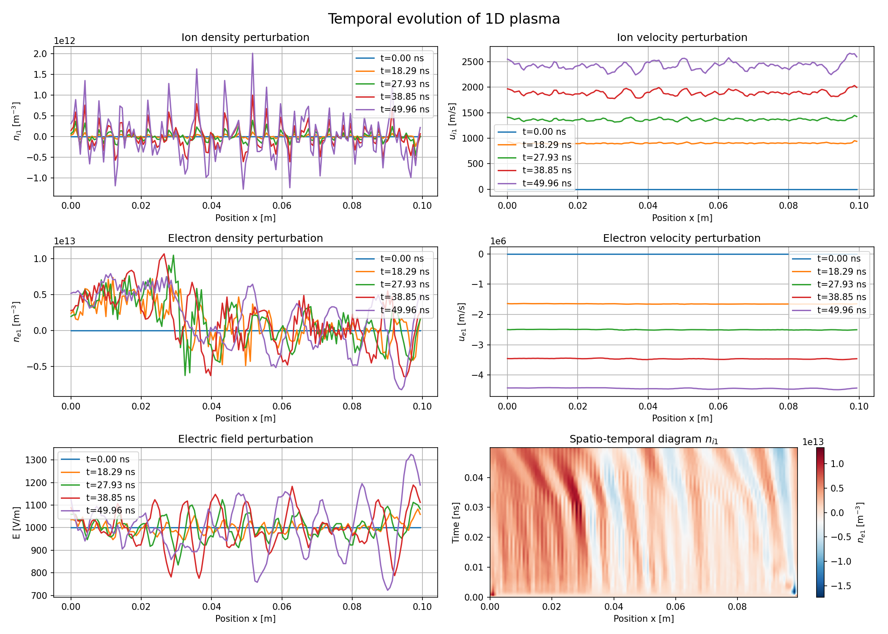

# 1D Bi-Plasma Simulation

A C++ simulation code for modeling 1D fluid plasma dynamics with coupled ion and electron perturbations using finite difference methods.

## Description

This project simulates the temporal evolution of a one-dimensional bi-species plasma system. It solves the coupled fluid equations for ion and electron density/velocity perturbations along with the electric field. The goal is to study wave propagation and instabilities in a plasma, keeping the second order terms.

### Physical Model

The code solves the following system of equations:

1. **Continuity equation** (for species s = i, e):
   
$$ \frac{\partial n_{s1}}{\partial t} + (n_{s0} + n_{s1}) \frac{\partial u_{s1}}{\partial x} + u_{s1} \frac{\partial n_{s1}}{\partial x} = 0 $$

2. **Momentum equation** (for species s = i, e):
   
$$ \frac{\partial u_{s1}}{\partial t} + u_{s1} \frac{\partial u_{s1}}{\partial x} = \frac{q_s E}{m_s} - \frac{1}{m_s n_s}\frac{\partial P_{s}}{\partial x} $$

   With the pressure gradient:

$$ \frac{1}{n_{s}} \frac{\partial P_{s}}{\partial x} = \frac{P_{s0}}{n_{s0}} \left[\frac{\gamma_s}{n_{s0}}\frac{\partial n_{s1}}{\partial x}\left(1 + \frac{\gamma_s n_{s1}}{n_{s0}}\right) - 2\frac{\gamma_s n_{s1}}{n_{s0}^2} \frac{\partial n_{s1}}{\partial x}\right] $$

3. **Poisson's equation**:
   
$$ \frac{\partial E}{\partial x} = \frac{1}{\varepsilon_0} (q_i n_{i1} + q_e n_{e1}) $$

Where:
- `n_s1`: Density perturbation [m⁻³]
- `u_s1`: Velocity perturbation [m/s]
- `E`: Electric field [V/m]
- `P_s`: Pressure [Pa]
- `q_s`: Charge [C]
- `m_s`: Mass [kg]

### Numerical Methods

The solver implements a **2nd-order 1D finite volume scheme** for nonlinear electrostatic plasma dynamics:

- **Spatial discretization**: Conservative form with MUSCL reconstruction (minmod limiter) for 2nd-order accuracy while avoiding non-physical oscillations
- **Numerical fluxes**: Rusanov scheme (Local Lax–Friedrichs) at interfaces, ensuring robustness and stability
- **Time integration**: MacCormack-type predictor–corrector scheme (2nd-order), with predictor step (advection + sources) and corrector step (backward reconstruction + time averaging)
- **Poisson's equation**: Tridiagonal linear solver on centered finite differences, solved at each substep for self-consistent electric field evolution
- **Boundary conditions**: Periodic
- **CFL condition**: 

$$ \Delta t \leq \text{cfl} \times \frac{\Delta x}{C_s} $$ 

where $C_s$ is the characteristic plasma sound speed.

## Dependencies

- **C++ compiler** with C++11 support (g++, clang++)
- **Eigen3** library (included in `include/Eigen/`)
- **CMake** (version 3.10 or higher)
- **Python 3** with matplotlib and numpy (for visualization)

## Project Structure

```
.
├── CMakeLists.txt          # CMake configuration file
├── README.md               # This file
├── include/
│   ├── constants.hpp       # Physical constants
│   ├── plasma.hpp          # PlasmaSystem class definition
│   └── Eigen/              # Eigen library headers
├── src/
│   ├── main.cpp            # Main simulation program
│   └── plot_time.py        # Python visualization script
├── build/                  # Build directory
├── data/                   # Output data files
└── image/                  # Generated plots
```

## Building the Project

1. **Create and navigate to the build directory**:
   ```bash
   mkdir -p build
   cd build
   ```

2. **Configure with CMake**:
   ```bash
   cmake ..
   ```

3. **Compile**:
   ```bash
   make
   ```

This will generate the `bi_plasma` executable in the `build/` directory.

## Running the Simulation

From the `build/` directory:

```bash
./bi_plasma
```

The program will:
1. Initialize the plasma system with a Gaussian density perturbation
2. Run the time evolution simulation
3. Save data to `data/` directory
4. Automatically run the visualization script to generate plots

## Output Files

The simulation generates the following data files in the `data/` directory:

- `time.txt`: Time array [s]
- `x_grid.txt`: Spatial grid [m]
- `n_i1_time.txt`: Ion density perturbation evolution
- `u_i1_time.txt`: Ion velocity perturbation evolution
- `n_e1_time.txt`: Electron density perturbation evolution
- `u_e1_time.txt`: Electron velocity perturbation evolution
- `E_time.txt`: Electric field evolution

Generated plots are saved in the `image/` directory.

## Exemple of results

<p align="center">  </p>

## License

This project is licensed under the MIT License - see the [LICENSE](LICENSE) file for details.

## Authors

Ewan Bataille