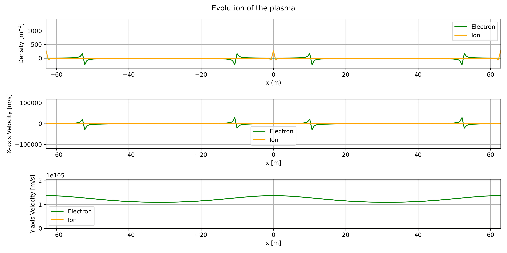

# 1D Two-Fluid + Maxwell Plasma Simulation (C++ / Eigen)

## Description

This project implements a **1D spectral simulation** of a collisionless plasma described by the **two-fluid model (ions + electrons)** coupled with **Maxwell’s equations**.  
It evolves the perturbations in Fourier space and reconstructs the physical fields in real space.  
Post-processing (plots, dispersion analysis) is done in Python.

---

## Governing Equations

We consider small perturbations around a homogeneous, neutral plasma with no background magnetic field.  
The two-fluid + Maxwell system (linearized) reads:

### Continuity equations
$$
\partial_t \delta n_s + n_{0s} \partial_x \delta u_{s,x} = 0, \quad s \in \{e,i\}
$$

### Momentum equations
$$
m_s \partial_t \delta u_{s,x} = q_s \delta E_x,
$$
$$
m_s \partial_t \delta u_{s,\perp} = q_s (\delta \mathbf{E}_\perp + \delta \mathbf{u}_{s,\perp}\times \mathbf{B}),
$$

where \(s\) is the species index (electrons \(e\), ions \(i\)).

### Maxwell equations (1D geometry)
- Longitudinal (electrostatic):
$`i k \delta E_x = \frac{e}{\varepsilon_0}(\delta n_i - \delta n_e).`$

- Transverse (electromagnetic):
$`\partial_t \delta E_y = c^2 \partial_x \delta B_z - \frac{1}{\varepsilon_0} \sum_s q_s n_{0s} \delta u_{s,y},`$
$`\partial_t \delta B_z = - \partial_x \delta E_y.`$

---

## Matrix Formulation

For each Fourier mode \(k\), the system can be written as:

$$
\frac{d}{dt} \mathbf{y}(k,t) = A(k)\,\mathbf{y}(k,t).
$$

### Longitudinal block (electrostatic, variables ($`\delta n_e, u_{e,x}, \delta n_i, u_{i,x})`$)):

$$
\mathbf{y}_L = 
\begin{bmatrix}
\delta n_e \\
\delta n_i \\
u_{e,x} \\
u_{i,x}
\end{bmatrix},
$$

$$
A_L(k) =
\begin{bmatrix}
0 & 0 & -ik n_{0e} & 0 \\
0 & 0 & 0 & -ik n_{0i} \\
\frac{omega_{pe}^2}{i k n_{0e}} - i c_{se}^2 k& -\frac{omega_{pe}^2}{i k n_{0e}} & 0 & 0 \\
-\frac{omega_{pi}^2}{i k n_{0i}} & \frac{omega_{pi}^2}{i k n_{0i}} - i c_{si}^2 & 0 & 0
\end{bmatrix}.
$$

This reproduces Langmuir and ion-acoustic modes.

---

### Transverse block (electromagnetic, variables $`(u_{e,y}, u_{i,y}, E_y, B_z)`$):

$$
\mathbf{y}_T =
\begin{bmatrix}
u_{e,y} \\
u_{i,y} \\
E_y \\
B_z
\end{bmatrix},
$$

$$
A_T(k) =
\begin{bmatrix}
0 & 0 & -\tfrac{e}{m_e} & 0 \\
0 & 0 & \tfrac{e}{m_i} & 0 \\
\tfrac{e n_{0e}}{\varepsilon_0} & -\tfrac{e n_{0i}}{\varepsilon_0} & 0 & i c^2 k \\
0 & 0 & -i k & 0
\end{bmatrix}.
$$

This reproduces electromagnetic plasma waves with dispersion
$`\omega^2 = \omega_p^2 + c^2 k^2.`$

---

<p align="center">  </p>

## 📂 Structure du Projet

```
1D_Bi_Plasma/
├── include/                  # En-têtes C++
│   ├── bi_system.hpp        # Définition du système bi-fluide + Maxwell
│   ├── constants.hpp        # Constantes physiques et numériques
│   ├── field.hpp           # Gestion des champs E et B
│   ├── fourier.hpp         # Interface des transformées de Fourier
│   ├── plasma.hpp          # Paramètres et initialisation du plasma
│   └── Eigen/              # Bibliothèque d'algèbre linéaire
│
├── src/                     # Code source C++
│   ├── fourier.cpp         # Implémentation des transformées de Fourier
│   ├── main.cpp            # Point d'entrée de la simulation
│   └── plot.py            # Visualisation et post-traitement
│
├── build/                   # Répertoire de compilation (généré)
├── data/                    # Données d'entrée/sortie
└── CMakeLists.txt          # Configuration du build
```

## 🛠️ Build & Run

### Dépendances
- CMake (>= 3.10)
- Compilateur C++ avec support C++17
- Eigen (incluse dans le projet)

### Linux / macOS

```bash
cd build
cmake ..
make
./bi_plasma
```

### Visualisation
```bash
python ../src/plot.py
```

### 👤 Author
- Ewan Bataille
