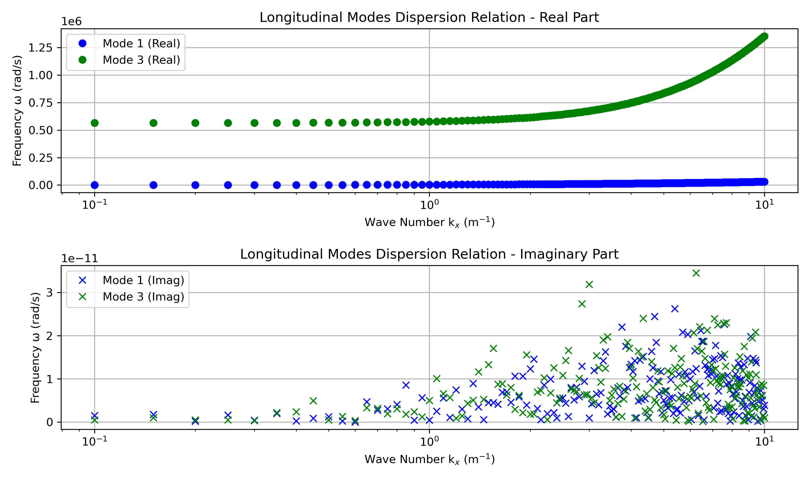

# 1D Two-Fluid + Maxwell Plasma Simulation (C++ / Eigen)

## Description

This project implements a **1D spectral simulation** of a collisionless plasma described by the **two-fluid model (ions + electrons)** coupled with **Maxwell’s equations**.  
It evolves the perturbations in Fourier space and reconstructs the physical fields in real space.  
Post-processing (plots, dispersion analysis) is done in Python.

---

## Governing Equations

We consider small perturbations around a homogeneous, neutral plasma with no background magnetic field.  
The two-fluid + Maxwell system (linearized) reads:

### Continuity equations
$$
\partial_t \delta n_s + n_{0s} \partial_x \delta u_{s,x} = 0, \quad s \in \{e,i\}
$$

### Momentum equations
$$
m_s \partial_t \delta u_{s,x} = q_s \delta E_x,
$$
$$
m_s \partial_t \delta u_{s,\perp} = q_s (\delta \mathbf{E}_\perp + \delta \mathbf{u}_{s,\perp}\times \mathbf{B}),
$$

where \(s\) is the species index (electrons \(e\), ions \(i\)).

### Maxwell equations (1D geometry)
- Longitudinal (electrostatic):
$`i k \delta E_x = \frac{e}{\varepsilon_0}(\delta n_i - \delta n_e).`$

- Transverse (electromagnetic):
$`\partial_t \delta E_y = c^2 \partial_x \delta B_z - \frac{1}{\varepsilon_0} \sum_s q_s n_{0s} \delta u_{s,y},`$
$`\partial_t \delta B_z = - \partial_x \delta E_y.`$

---

## Matrix Formulation

For each Fourier mode \(k\), the system can be written as:

$$
\frac{d}{dt} \mathbf{y}(k,t) = A(k)\,\mathbf{y}(k,t).
$$

### Longitudinal block (electrostatic, variables ($`\delta n_e, u_{e,x}, \delta n_i, u_{i,x})`$)):

$$
\mathbf{y}_L = 
\begin{bmatrix}
\delta n_e \\
\delta n_i \\
u_{e,x} \\
u_{i,x}
\end{bmatrix},
$$

$$
A_L(k) =
\begin{bmatrix}
0 & 0 & -ik n_{0e} & 0 \\
0 & 0 & 0 & -ik n_{0i} \\
\frac{\omega_{pe}^2}{i k n_{0e}} - \frac{i c_{se}^2 k}{n_{0e}} & -\frac{\omega_{pe}^2}{i k n_{0e}} & 0 & 0 \\
-\frac{\omega_{pi}^2}{i k n_{0i}} & \frac{\omega_{pi}^2}{i k n_{0i}} - \frac{i c_{si}^2 k}{n_{0i}} k & 0 & 0
\end{bmatrix}.
$$

This reproduces Langmuir and ion-acoustic modes.

---

### Transverse block (electromagnetic, variables $`(u_{e,y}, u_{i,y}, E_y, B_z)`$):

$$
\mathbf{y}_T =
\begin{bmatrix}
u_{e,y} \\
u_{i,y} \\
E_y \\
B_z
\end{bmatrix},
$$

$$
A_T(k) =
\begin{bmatrix}
0 & 0 & -\frac{e}{m_e} & 0 \\
0 & 0 & \frac{e}{m_i} & 0 \\
\frac{e n_{0e}}{\varepsilon_0} & -\frac{e n_{0i}}{\varepsilon_0} & 0 & i c^2 k \\
0 & 0 & -i k & 0
\end{bmatrix}.
$$

This reproduces electromagnetic plasma waves with dispersion
$`\omega^2 = \omega_p^2 + c^2 k^2.`$

---

<p align="center">  </p>

##  Project Structure

```
1D_Bi_Plasma/
├── CMakeLists.txt          # CMake build configuration
├── README.md               # Project documentation
├── .gitignore             # Git ignore rules
├── build/                 # Build directory (generated by CMake)
├── data/                  # Input and output data
├── include/               # C++ header files
│   ├── bi_system.hpp      # Two-fluid + Maxwell system definition
│   ├── constants.hpp      # Physical and numerical constants
│   ├── field.hpp          # Field storage and access
│   ├── fourier.hpp        # Fourier transforms interface
│   ├── plasma.hpp         # Plasma parameters and initialization
│   └── Eigen/             # Eigen library (header-only)
└── src/                   # C++ source files
    ├── fourier.cpp        # Fourier transform implementation
    ├── main.cpp           # Simulation entry point
    └── plot.py            # Python visualization script
```

## Build & Run

### Prerequisites
- CMake (>= 3.10)
- C++ compiler with C++17 support (g++, clang++)
- Eigen library (included in the project)
- Python 3.x with matplotlib and numpy (for visualization)

### Compilation (Linux / macOS)

```bash
mkdir -p build
cd build
cmake ..
make
```

### Running the Simulation

```bash
./bi_plasma
```

### Visualization

Generate plots and analyze results:
```bash
cd ../src
python plot.py
```

## Author
- Ewan Bataille
